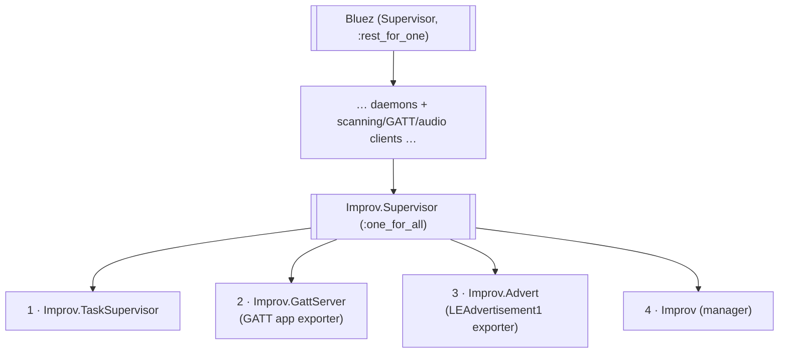
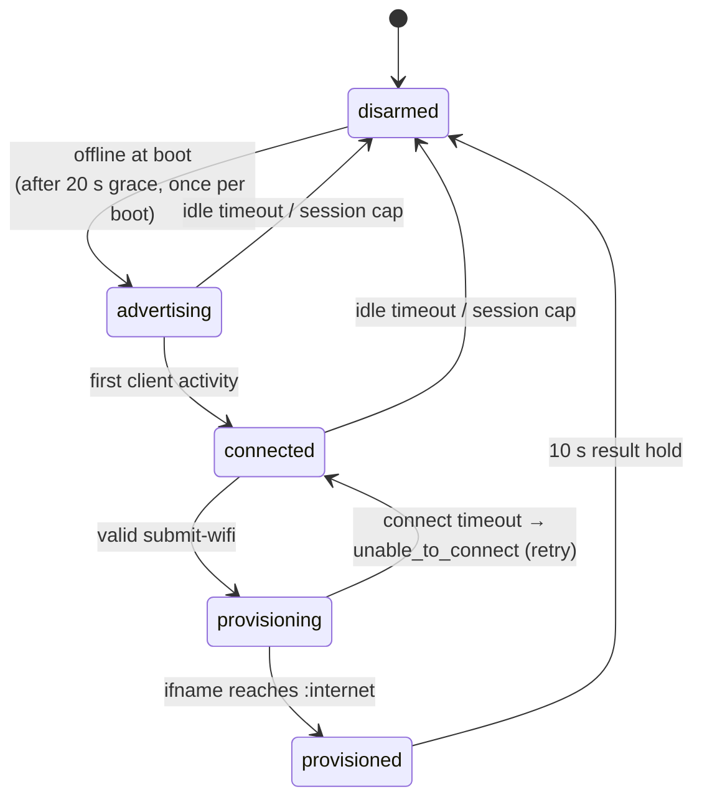

# Architecture

Improv is a consumer of the [bluez](https://hexdocs.pm/bluez) subtree: it
exports a GATT application and an LE advertisement over D-Bus and drives
them from a small state machine. The library never calls back into named
modules of yours — everything app-specific (connectivity probe, branding,
identify action, device-info strings) is injected through
`Improv.Supervisor`'s opts.

## Supervision tree

`Improv.Supervisor` is a `:one_for_all` group mounted in `Bluez`'s
`extra_children:` slot, appended **last**:



Both placements are load-bearing:

- **Appended last under `:rest_for_one`**: a `bluetoothd`/`Bluez.Client`
  restart rebuilds the whole Improv group — whose exporters hold
  now-stale D-Bus registrations — while an Improv fault never disturbs
  anything before it (the host's scanning/GATT or audio stacks).
- **`:one_for_all` internally**: the manager registers and drives the
  exporters, so a crash of any one process must restart all of them
  together. Restarting the group drops the exporters' `rebus`
  connections, which makes `bluetoothd` auto-unregister the GATT
  application and advertisement — teardown is implicit in process death,
  with no cleanup code to get wrong.

The `Task.Supervisor` exists because BlueZ's
`RegisterApplication`/`RegisterAdvertisement` calls are re-entrant: BlueZ
reads the exporter's whole object tree by calling back into the exporting
process before the register call returns, so registration must run off
the GenServer loop or it deadlocks. It also runs the host's
`identify_fun:` and the Wi-Fi scan (both block for seconds).

## Modules

| Module | Role |
| ------ | ---- |
| `Improv` | Manager GenServer: arm gate, FSM, session timers, RPC dispatch |
| `Improv.GattServer` | Exports the Improv GATT service + 5 characteristics; serves BlueZ's ReadValue/WriteValue/notify calls |
| `Improv.Advert` | Exports the `LEAdvertisement1` object; registers/unregisters it on arm/disarm |
| `Improv.Protocol` | Pure wire codec — every byte read or notified is built and parsed here |
| `Improv.Wifi` | VintageNet-backed scan/configure/redirect backend (optional, injectable) |
| `Improv.Supervisor` | The `:one_for_all` group; derives the capabilities byte once |

The split keeps I/O shells thin: the GATT tree/props/read logic, the
advertisement property list, and the whole protocol codec are pure
functions, host-tested without D-Bus or a radio.

## Manager state machine



Arming exports the GATT app + advertisement and suspends the host's
proxy scan (`suspend_scan` cast to the `scanner:`, `Bluez.Client` by
default — there is no client consuming scan results on an offline boot,
and it frees the radio for the peripheral connection). Disarming reverses
both. A failed or timed-out connect is **not** a distinct FSM state: it
reverts `provisioning → connected` and surfaces the error byte via
`state.error`, so the provisioner can retry within the session.

`PROVISIONED` is detected via VintageNet connectivity events, and only
when the provisioning interface itself reaches full `:internet` — `:lan`
is not success (a wrong password flaps associate → handshake-fail → drop,
blipping `:lan` transiently), and other interfaces say nothing about the
submitted credentials.

## D-Bus surface

The exporters own separate `rebus` connections (separate failure
domains) and export:

```
/org/improv                    org.freedesktop.DBus.ObjectManager
/org/improv/service0           org.bluez.GattService1
/org/improv/service0/char0..4  org.bluez.GattCharacteristic1
/org/improv/advert0            org.bluez.LEAdvertisement1
```

Registration happens **on demand** (when the manager arms), not at
startup — so the exporters sit idle on an online boot, and a registration
failure is healed by flipping the optimistic `registered?` flag back so a
later arm retries. Notifications are
`org.freedesktop.DBus.Properties.PropertiesChanged` signals on the
characteristic paths, emitted only after a client subscribes via
`StartNotify`.
